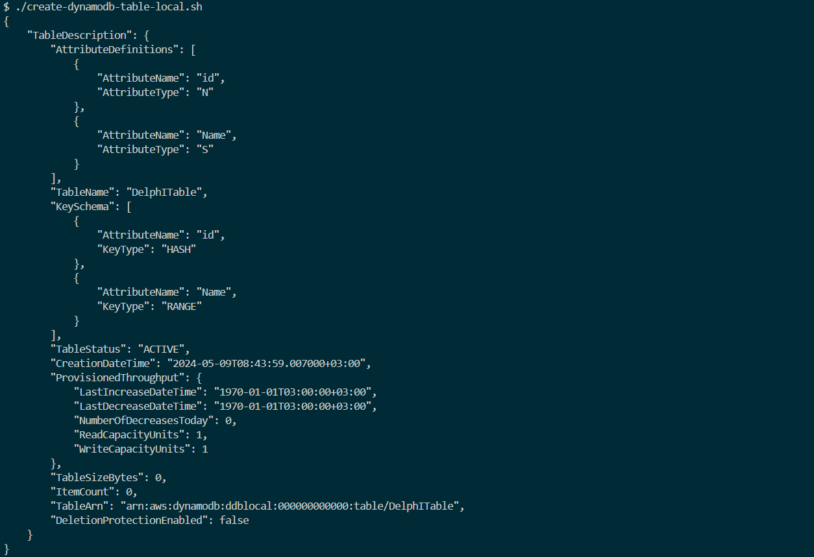
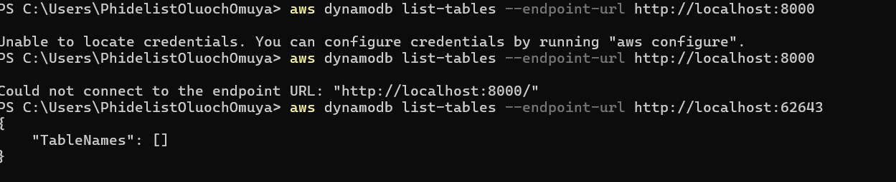

https://www.nuget.org/packages/Aspire.Hosting.AWS

## Connecting to dynanodb local
 aws dynamodb list-tables --endpoint-url http://localhost:{PORT}/

## Dynamodb create table 
aws dynamodb create-table \
    --table-name DelphITable \
    --attribute-definitions \
        AttributeName=Id,AttributeType=N \
        AttributeName=Name,AttributeType=S \
    --key-schema AttributeName=Id,KeyType=HASH AttributeName=Name,KeyType=RANGE\
    --provisioned-throughput ReadCapacityUnits=1,WriteCapacityUnits=1 \
    --table-class STANDARD\
    --endpoint-url http://localhost:62643

